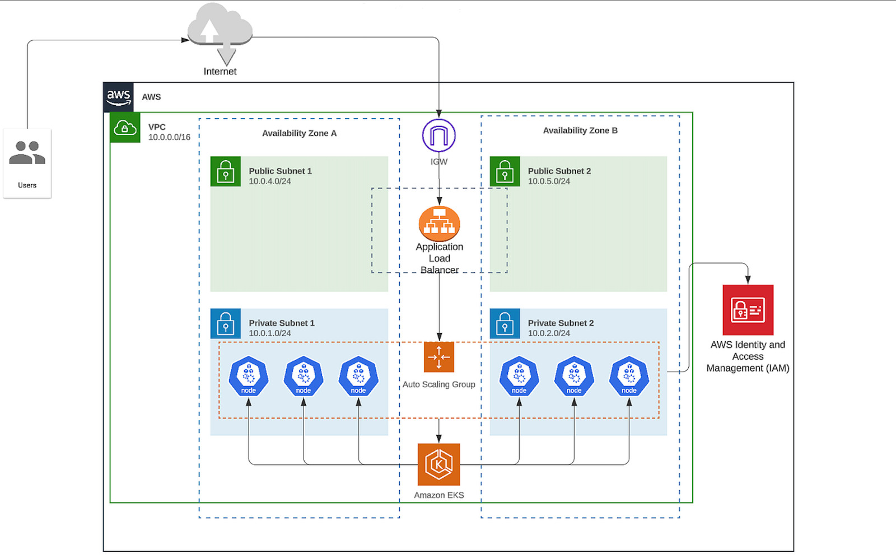
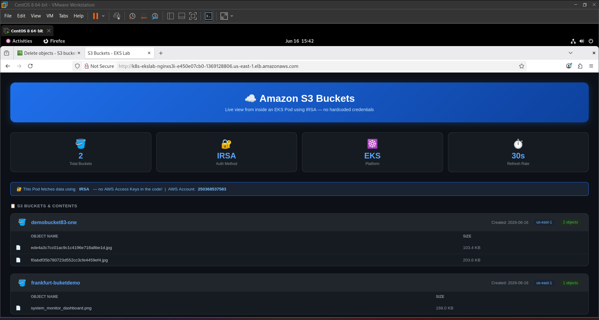

<div align="center">

# AWS EKS S3 Viewer

A production-style Kubernetes project on Amazon EKS — fully automated, zero hardcoded credentials.

[](https://www.terraform.io/)
[](https://kubernetes.io/)
[](https://aws.amazon.com/eks/)
[](LICENSE)

</div>

---

<div align="center">

| Architecture | Live Result |
|:---:|:---:|
|  |  |

</div>

---

## Overview

This project provisions a complete, production-style EKS environment on AWS using Terraform and Kubernetes. It deploys a live web application that lists S3 bucket contents, secured end-to-end through **IRSA (IAM Roles for Service Accounts)** — no Access Keys, no secrets in code.

Built as a hands-on lab to demonstrate real-world DevOps and cloud-native engineering patterns.

---

## Architecture

```
Internet
   │
   ▼
Internet Gateway
   │
   ▼
Application Load Balancer  ◄── public subnets (us-east-1a / 1b)
   │
   ▼
Nginx Pod  ◄── private subnets (EKS worker nodes)
   │
   ▼
AWS S3  ◄── authenticated via IRSA (no credentials stored)
```

**Traffic flow:** `Internet → IGW → ALB (public subnets) → Nginx Pod (private subnets) → S3 via IRSA`

---

## Key Features

| Feature | Details |
| :--- | :--- |
| **IRSA** | Pods assume an IAM Role via OIDC — zero Access Keys anywhere in the codebase |
| **AWS LB Controller** | Kubernetes Ingress automatically provisions a live ALB |
| **Private Worker Nodes** | EKS nodes live in private subnets, unreachable directly from the internet |
| **Sidecar Pattern** | AWS CLI sidecar writes S3 data to a shared volume; Nginx serves it as HTML |
| **Full IaC** | Every resource is reproducible with a single `terraform apply` |

---

## Infrastructure

### Network — `vpc.tf`

| Resource | Value |
| :--- | :--- |
| VPC CIDR | `10.0.0.0/16` |
| Public Subnets | 2 × AZ (ALB) |
| Private Subnets | 2 × AZ (EKS Nodes) |
| NAT Gateway | Outbound internet for private nodes |

### IAM & Security — `iam.tf`

- **`eks-lab-pod-role`** — scoped with `s3:ListAllMyBuckets`, `s3:ListBucket`, and `s3:GetObject` via IRSA
- **OIDC Provider** — bridges Kubernetes ServiceAccount tokens with AWS STS for keyless auth

---

## Repository Structure

```
.
├── terraform/
│   ├── providers.tf        # AWS + Kubernetes provider config
│   ├── vpc.tf              # VPC, subnets, IGW, NAT Gateway, route tables
│   ├── eks.tf              # EKS cluster + managed node group
│   ├── iam.tf              # IRSA role, OIDC provider, S3 policy
│   └── alb-controller.tf   # AWS Load Balancer Controller via Helm
│
└── k8s/
    ├── 01-namespace-sa.yaml    # Namespace + ServiceAccount (IRSA annotation)
    ├── 03-deployment.yaml      # Nginx + AWS CLI sidecar containers
    ├── fetch-s3.sh             # Shell script: fetches S3 bucket list
    └── render.py               # Python: renders bucket list as HTML
```

---

## Getting Started

### Prerequisites

- [Terraform](https://developer.hashicorp.com/terraform/install) >= 1.5
- [AWS CLI](https://docs.aws.amazon.com/cli/latest/userguide/install-cliv2.html) configured with appropriate permissions
- [kubectl](https://kubernetes.io/docs/tasks/tools/)
- [Helm](https://helm.sh/docs/intro/install/) >= 3.x

### Deploy

```bash
# 1. Clone the repo
git clone https://github.com/<your-username>/aws-eks-s3-viewer.git
cd aws-eks-s3-viewer/terraform

# 2. Initialize Terraform
terraform init

# 3. Review the plan
terraform plan

# 4. Deploy infrastructure (~15 minutes)
terraform apply

# 5. Configure kubectl
aws eks update-kubeconfig --region us-east-1 --name <cluster-name>

# 6. Apply Kubernetes manifests
kubectl apply -f ../k8s/
```

### Access the App

```bash
# Get the ALB DNS name
kubectl get ingress -n eks-lab

# Open in browser
http://<ALB-DNS-NAME>
```

### Teardown

```bash
# Delete K8s resources first (removes ALB created by the controller)
kubectl delete -f ../k8s/

# Then destroy infrastructure
cd terraform
terraform destroy
```

> **Note:** The ALB and its Target Groups are provisioned by the AWS Load Balancer Controller, not by Terraform. Delete the Kubernetes Ingress resource before running `terraform destroy` to avoid stuck resource dependencies.

---

## Concepts Demonstrated

- **IRSA** — keyless AWS authentication for Kubernetes workloads
- **AWS Load Balancer Controller** — automated ALB provisioning from Kubernetes Ingress
- **Sidecar container pattern** — shared volume between two containers in a Pod
- **Private EKS nodes** — secure network topology with NAT Gateway egress
- **Infrastructure as Code** — full environment reproducibility via Terraform

---

## License

MIT
